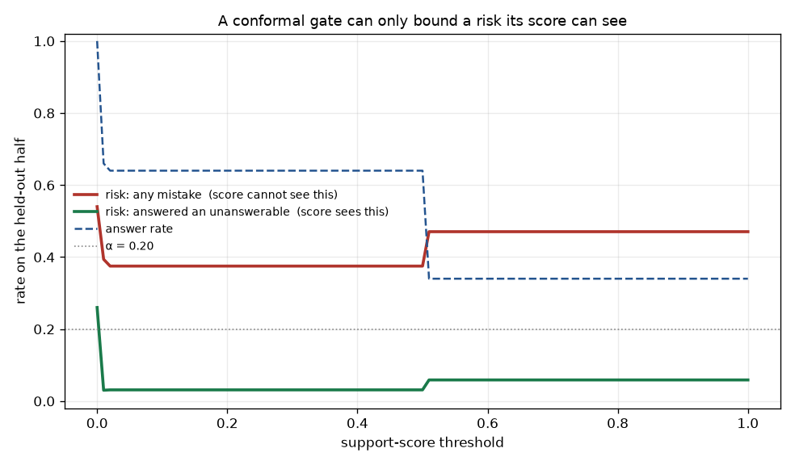
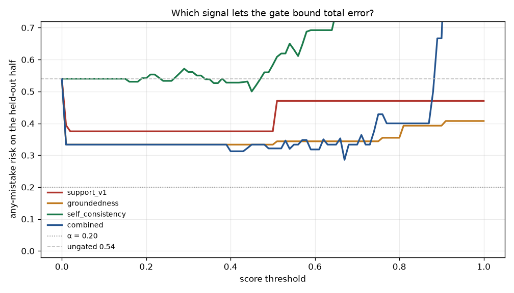

# Results

**No benchmark numbers yet — honestly.** Retrieval recall, answer correctness and
abstention risk require the manually verified golden set (M1/M4); until then this
file records only what has actually been run, which is the pipeline working
end to end.

## Verified end to end, 2026-07-31

Corpus: 1,752 chunks from two public-domain US Army technical manuals.
Model: `qwen2.5:3b-instruct` via local Ollama. Retrieval: hybrid BM25 + vectors,
RRF-fused.

**Grounded answer with a citation.** *"What is the purpose of the cooling system
thermostat in an engine?"* →

> The thermostat in an engine's cooling system regulates engine temperature by
> controlling the amount of coolant flowing from the engine block to the radiator
> core. It operates based on heat, and if it fails, it will be in the opened
> position so as to allow the free circulation of coolant through the engine **[4]**.

with `[4]` resolving to TM-9-8000 p.241. All five hits found by **both** retrievers.

**Correct refusal.** *"What should be inspected before starting the generator
set?"* → `INSUFFICIENT EVIDENCE`. Retrieval surfaced only the automotive manual
(the generator document in the corpus is a parts catalogue with no pre-start prose),
and the system declined rather than improvising from adjacent text. This is the
intended behaviour and it happened without the conformal gate even being fitted —
the gate makes the refusal rate *calibrated*, the prompt makes it *possible*.

**Agent tool loop.** `calculator` → `17 * 23` → `391`, one step, clean JSON protocol.

**Cross-project composition.** `predict_rul` called the live
[conformal-rul](https://github.com/mateus-aleixo/conformal-rul) service on AWS
Lambda with a real C-MAPSS cycle:

```json
{"rul_cycles": 118.9,
 "interval": {"lower": 87.5, "upper": 125.0, "coverage": 90},
 "risk_band": "healthy", "model": "transformer"}
```

## M1 — retrieval, measured 2026-07-31

Golden set: 20 questions (15 answerable, 5 unanswerable), written by **reading the
source chunks**, not by asking the retriever where it would look — grounding gold on
the retriever's own top hit would only measure its tie-breaking. Scored at page level
with ±1 slack, because chunks overlap and a boundary can split an answer.
Corpus: 1,752 chunks. `python scripts/eval_retrieval.py --embedder {hash,bge}`

| embedder | recall@5 | recall@1 | MRR | top hit found by both retrievers |
|---|---|---|---|---|
| `hash` (deterministic placeholder, CI default) | 0.93 | 0.73 | 0.851 | 18/20 |
| **`bge-small-en-v1.5`** | **1.00** | **0.93** | **0.950** | 19/20 |

Real embeddings fix the one miss — a "what keeps the brakes working if the power
steering fails?" question that the lexical path answered with the wrong page while
reporting **high** confidence (0.969). Hybrid retrieval is doing real work either
way: the top hit was found by *both* BM25 and the vector search on 18–19 of 20
questions, so this is not BM25 with extra steps.

### The finding that matters, and it is not the recall

| embedder | mean confidence, answerable | unanswerable | **gap** |
|---|---|---|---|
| `hash` | 0.946 | 0.643 | **0.303** |
| `bge` | 0.992 | 0.831 | **0.161** |

**Better retrieval made the abstention signal worse.** Recall went up and the gap
between answerable and unanswerable questions roughly halved — because a stronger
retriever confidently finds *something* topically plausible even when the corpus
cannot answer the question. Retrieval agreement measures "did my retrievers concur",
which is not the same as "is the answer in here".

That is a problem for M4, and a useful one: it means the conformal gate cannot be
built on retrieval confidence alone, and the nonconformity score needs a
judge-based signal. Better to learn that from a 20-question eval than from a
calibration that quietly certifies confident nonsense. The unanswerable questions
were written to be *plausible* (a torque spec for an engine the corpus does not
cover) rather than absurd, which is precisely why they are hard to separate.

## M2 — answers, measured 2026-07-31

Same 20 questions through the full pipeline. `qwen2.5:3b-instruct` via local
Ollama, bge retrieval. `python scripts/eval_answers.py --provider ollama`

Three things are scored, all decidable without a judge model:

| | | |
|---|---|---|
| **Refusal on unanswerable** | **5 / 5 = 1.00** | said `INSUFFICIENT EVIDENCE` rather than improvising |
| Answer rate on answerable | 14 / 15 = 0.93 | |
| **Invalid citations** | **0 / 20 responses** | every `[n]` indexed a excerpt that was actually supplied |
| Answers carrying a citation | 14 / 14 = 1.00 | |
| Median latency | 3.7 s | 3 B model, CPU-class hardware |

Semantic correctness — "is the answer *right*" — is deliberately **not** scored
here. That needs a judge model and a rubric (M4/M5). Approximating it with string
overlap would produce a number that looks like accuracy and isn't.

### This answers the question M1 raised

M1 found that better retrieval *shrank* the confidence gap between answerable and
unanswerable questions (0.303 → 0.161), which made retrieval agreement look like a
poor basis for abstention. M2 shows where the signal actually lives: **the model
reading the excerpts separated them perfectly, 5 out of 5, where retrieval
confidence could not.**

So the M4 nonconformity score should be built on the generation step, not the
retrieval step. That is a design decision now supported by evidence rather than by
taste — and it is the opposite of what the v0 confidence heuristic assumed.

**Sample-size caveat, stated plainly:** 5/5 on five questions is not a 100% refusal
rate. It is "no failures observed in five attempts", whose 95% upper bound is
roughly 45%. The number to trust is the *direction*, not the value. Expanding the
unanswerable set is the first task of M4, precisely because the gate will be
calibrated against it.

### The one over-refusal

`g-05` — *"Why does damping on rebound only force the use of stiffer springs?"* —
was refused despite the answer being on the retrieved page. It is the only
**reasoning**-type question that required combining two sentences rather than
quoting one. The system errs conservative, which is the right direction for a
maintenance assistant, but it marks a real ceiling: strict grounding prompts
suppress inference, and questions needing a short chain of reasoning are where
that costs recall.

## M4 — the conformal gate, measured 2026-07-31

Golden set grown to **100 questions** (75 answerable, 25 not) — the 20 hand-written
ones plus 80 generated from real chunks (`scripts/gen_golden.py`; its sampling bias is
documented in that file). Each question scored: retrieve → `support_score` → answer →
judge against the reference. Threshold fitted on a random half, every number below
from the other half.



### The gate does not work for the risk it was designed for

| loss | ungated risk | best achievable | verdict |
|---|---|---|---|
| **any mistake** (unanswerable *or* wrong answer) | 0.540 | 0.471 at any threshold; α=0.5 is the first that is met | **fails α ≤ 0.4** |
| **answered an unanswerable question** | 0.260 | **0.031** at threshold 0.50, still answering **64%** | **works at α = 0.1** |

For the second loss this is a real result: the rate of answering questions the corpus
cannot answer falls from **26% to 3.1%**, while two thirds of questions still get
answered. That is what a working abstention gate looks like.

For the first, no threshold helps. The reason is one line of arithmetic:

```
support score, answerable vs unanswerable    0.640  vs  0.080   <- separated
support score, correct vs incorrect answers  0.651  vs  0.625   <- NOT separated
```

**The score judges the excerpts, so it can see answerability and is nearly blind to
correctness.** Conformal risk control bounds a risk its nonconformity score can rank;
it cannot bound one the score cannot see. With 43% of *answerable* questions answered
wrongly by a 3 B model — and the judge counting INCOMPLETE as a failure — the selective
risk floor sits near that base rate regardless of where the threshold goes.

This is the honest ceiling of the design: **the gate controls "should I have answered
at all", not "is this answer right".** Those are different guarantees and conflating
them is exactly the mistake the repo exists to argue against.

### A self-inflicted problem: the score is quantised

| value | count |
|---|---|
| 0.00 | 32 |
| 0.01 | 1 |
| 0.50 | 34 |
| 1.00 | 33 |

**Four distinct values across 100 questions**, so only four usable thresholds. The
cause is my own prompt: it offered 0 / 50 / 100 as anchors and the model treated them
as the entire scale. Conformal calibration wants a continuous score to place a tight
threshold; this gives it a three-way switch, which is why the risk curves are step
functions with long plateaus. Fixes, in order of honesty: read token logprobs for the
score, drop the anchors and ask for a bare integer, or sample the judgement several
times and average. Worth stating plainly — the limitation is in the prompt, not in the
method.

### What would actually reach α on total error

1. **A stronger generator.** 43% wrong on answerable questions is the dominant term;
   no gate fixes a base rate that high.
2. **A nonconformity score that predicts correctness** — self-consistency across
   samples, or an entailment check between answer and cited excerpt. Both cost more
   calls, which is the trade to measure next.
3. Not: a bigger calibration set. That tightens the estimate, it does not move the
   floor.

## M5 — a correctness-aware score, measured 2026-07-31

M4 left one question: can a different nonconformity score bound *total* error, not
just answerability? Four candidates, scored on the same 100 questions, ranked by
**AUC over correct-vs-incorrect answers** — the threshold-free version of "can a gate
built on this work at all". 0.5 is a coin flip.

| score | what it inspects | correct | incorrect | **AUC** | distinct values |
|---|---|---|---|---|---|
| `support_v1` | question + excerpts | 0.651 | 0.625 | **0.511** | 4 |
| `support_v2` | same, no anchors in the prompt | 0.483 | 0.466 | **0.519** | 16 |
| `groundedness` | **the answer** vs its excerpts | 0.928 | 0.722 | **0.582** | 7 |
| `self_consistency` | agreement across 3 sampled answers | 0.566 | 0.443 | **0.680** | 70 |
| **`combined`** | √(groundedness × self-consistency) | — | — | **0.754** | — |

### My quantisation hypothesis was wrong

M4 blamed the flat risk curves on the support prompt's 0/50/100 anchors, and predicted
that removing them would help. `support_v2` removed them: distinct values went **4 →
16**, and AUC moved **0.511 → 0.519**. Essentially nothing.

So the anchors caused the *granularity* problem and not the *blindness*. The real
cause is structural — `support_score` never sees the answer, so it cannot rank whether
the answer is right, no matter how finely it is expressed. Worth recording as a wrong
call: the fix I proposed would not have worked, and only measuring it showed that.

### The two useful signals are complementary, not redundant

| | ranks correctness | ranks answerability |
|---|---|---|
| `groundedness` | weakly (0.582) | **superbly** — 0.840 answerable vs 0.080 not |
| `self_consistency` | **best single** (0.680) | **backwards** — 0.513 vs 0.612 |

Their geometric mean beats both (**AUC 0.754**), which is what "complementary" means
in practice: one asks whether the excerpts support the claim, the other whether the
model is stable in making it, and the failures are different.

**`self_consistency` ranking answerability backwards is a genuine artefact worth
naming.** Unanswerable questions score *higher* agreement, because the model
consistently refuses them — and three identical refusals are perfect agreement. Used
alone the signal is also non-monotone (see the plot): above a threshold of ~0.45 the
risk *rises*, as the high-agreement bucket fills with confident repeated errors.



### The gate, recalibrated

| | best α met | held-out risk | answered |
|---|---|---|---|
| M4 (`support_v1`) | 0.50 | 0.375 | 64% |
| **M5 (`combined`)** | **0.40** | **0.312** | **64%** |

Ungated risk is 0.540. The combined gate cuts it to **0.312 while still answering 64%
of questions** — real progress, and still short of the α = 0.2 the project wants.

**The binding constraint is now unambiguous, and it is not the score.** 43% of
*answerable* questions are answered wrongly by a 3 B model. A gate can only decline to
answer; it cannot make a wrong answer right. Reaching α = 0.2 needs a better
generator, and no amount of calibration substitutes for one. That is the honest end of
this line of work, and it is worth more than a tuned number would have been.

## Does a bigger generator move the ceiling? — 2026-07-31

M5 concluded the binding constraint was the generator, not the score. Testing that
directly: same 100 questions, same corpus, same retrieval, **`qwen2.5:7b-instruct`**
in place of the 3 B model.

### Controlling the confound first

Swapping the model swaps the **judge** as well as the generator, so a lower error rate
could just be a softer grader. Re-running the 3 B answers through the **7 B judge**
isolates the generator (`scripts/compare_models.py --rejudge`):

| generator | judge | base error on answerable |
|---|---|---|
| 3 B | 3 B | 0.427 |
| **3 B** | **7 B** | **0.493** |
| 7 B | 7 B | 0.360 |

**The 7 B judge is stricter, not softer** — it fails 3 B answers 49.3% of the time
where the 3 B judge failed them 42.7%. That is the opposite of the bias I expected,
and it means the naive comparison *understated* what the bigger model bought:

- naive (each judged by itself): 0.427 → 0.360, a **16%** relative reduction
- like-for-like (both judged by 7 B): **0.493 → 0.360, a 27% relative reduction**

Worth stating plainly: without the control I would have published the smaller number
and been wrong about the size of the effect, in the direction that flatters the
smaller model.

### What it bought the gate

| | ungated risk | best α met | risk | coverage |
|---|---|---|---|---|
| 3 B (7 B-judged) | 0.620 | **none** | — | — |
| **7 B** | 0.540 | **0.40** | 0.378 | **74%** |

Coverage at the met threshold rises from 64% (M5's combined score on 3 B) to **74%**,
on the plain support score alone. The support score's own separation barely moved
(0.640/0.080 → 0.685/0.060), which is the expected result — it measures the excerpts,
and the excerpts did not change.

### The conclusion, unchanged in direction and sharper in size

A 7 B generator is a **real** improvement — a quarter of the errors gone, like-for-like
— and **still not enough for α = 0.2**. At a 36% base error rate on answerable
questions, a gate that can only decline to answer cannot get selective risk to 0.2
without refusing most of the corpus.

The honest reading is that this pipeline needs a generator in a different class, not
one size step up; and that the calibration machinery has been correct throughout —
it reported an unreachable target rather than quietly hitting it.

## 14 B — the gate finally meets α = 0.2, for a reason I did not predict

`qwen2.5:14b-instruct` (9 GB, 57%/43% CPU/GPU on a 6 GB card, ~28 s/question).
Every generator re-judged by the **same 14 B judge**, so the rows are comparable.

| generator | base error (14 B judge) | support: answerable / unanswerable |
|---|---|---|
| 3 B | 0.427 | 0.640 / 0.080 |
| **7 B** | **0.347** | 0.685 / 0.060 |
| 14 B | 0.373 | 0.687 / **0.020** |

| generator | ungated | best α met | risk | coverage |
|---|---|---|---|---|
| 3 B | 0.580 | none | — | — |
| 7 B | 0.540 | 0.40 | 0.378 | 74% |
| **14 B** | 0.540 | **0.20** | **0.133** | 30% |

### The 14 B answers slightly *worse* than the 7 B, and gates far better

Base error goes **up** from 0.347 to 0.373 between 7 B and 14 B, judged identically.
Yet 14 B is the first configuration to meet α = 0.2 — a target three earlier
configurations could not reach at any threshold.

The reason is in the last column of the first table. What improved with scale was not
answer accuracy but **the model's judgement about the evidence**: mean support score on
questions the corpus cannot answer falls **0.080 → 0.060 → 0.020**. The 14 B is
markedly better at recognising when the excerpts do not contain the answer, and a
conformal gate converts exactly that into a guarantee.

**So scaling bought calibration, not correctness.** That is not what "the binding
constraint is the generator" predicted — the prediction was right about the *outcome*
and wrong about the *mechanism*.

The cost is coverage: 30% at α = 0.2, against 74% at α = 0.4. The gate reaches the
target by declining seven questions in ten. That is a real guarantee and a real price,
and which one matters depends on whether a wrong maintenance answer is worse than no
answer — for this domain, it is.

### Correction: "a bigger judge is stricter" was wrong

The 7 B write-up above concluded the 7 B judge was stricter than the 3 B one and
inferred a trend. The 14 B judge breaks it — on the *same* 3 B answers:

| judge | base error on 3 B answers |
|---|---|
| 3 B | 0.427 |
| 7 B | **0.493** |
| 14 B | 0.427 |

The 7 B judge is stricter than **both** its neighbours. There is no monotone
relationship between judge size and severity; I drew a line through two points and the
third disqualified it. The practical lesson stands and is in fact strengthened —
**hold the judge fixed when comparing generators** — but the reason is that judges vary
unpredictably, not that they get harsher with scale.

## Still to come
- **More hand-written questions.** 100 is enough to expose these effects; the
  generated majority skews toward catalogue lookups (11 of 60 ask for part or figure
  numbers), which are easier than real maintenance questions.
- **M4** — reranker before/after: recall@5 without vs with the trained cross-encoder.
- **M4** — abstention: held-out selective risk vs α, answer rate, Mondrian breakdown.
- **M5** — answer correctness (judge + exact-match subset), cost and latency by provider.

Planned tables (see README roadmap):

- **M1** — retrieval recall@5 on the manually verified golden set (not the seeds).
- **M4** — reranker before/after: recall@5 without vs with the trained
  cross-encoder, same split, same seed.
- **M4** — abstention: held-out selective risk vs α, answer rate, per-group
  (Mondrian) breakdown, and the risk plot.
- **M5** — end-to-end answer correctness (LLM-judge + exact-match subset), cost
  and latency per question by provider.

Rule carried over from conformal-rul: the headline is whatever the data says,
including when the boring baseline wins.
